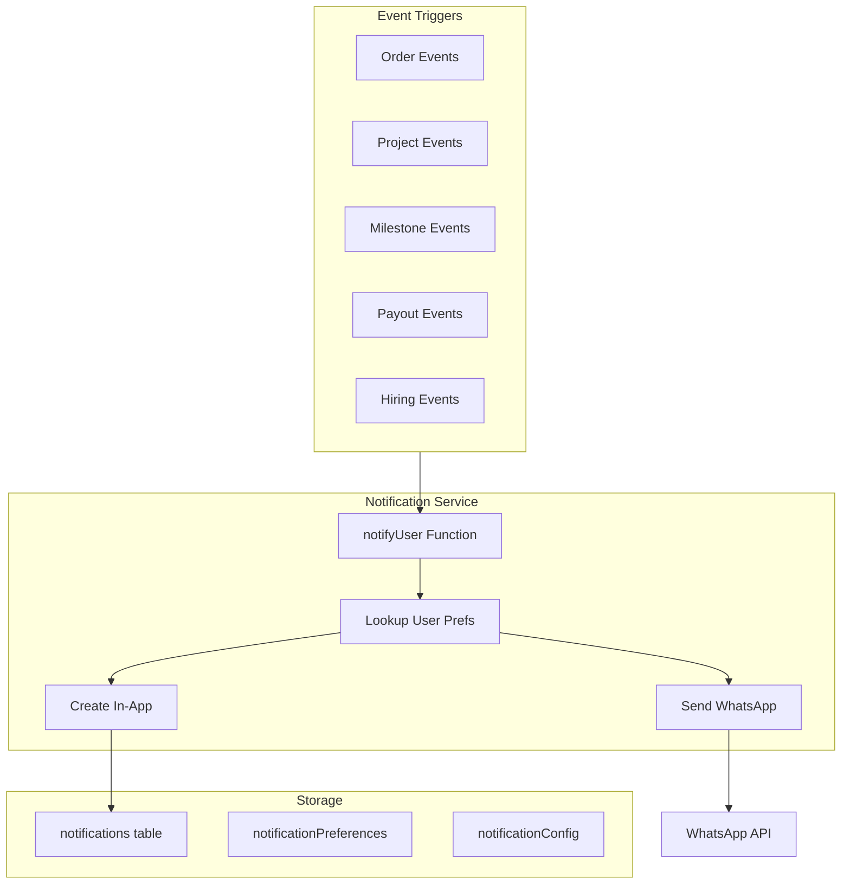

# Notification Module Plan

## Architecture Overview




## 1. Complete Trigger List by Role

### EDITOR Notifications (10 triggers)


| Trigger                      | Event                       | WhatsApp | In-App |
| ---------------------------- | --------------------------- | -------- | ------ |
| `editor.invitation.received` | Invited to project          | Yes      | Yes    |
| `editor.invitation.expired`  | Invitation expired          | Yes      | Yes    |
| `editor.milestone.assigned`  | Milestone assigned          | Yes      | Yes    |
| `editor.submission.approved` | Work approved with QC       | Yes      | Yes    |
| `editor.submission.rejected` | Work rejected with feedback | Yes      | Yes    |
| `editor.payout.unlocked`     | Project earnings unlocked   | Yes      | Yes    |
| `editor.payout.processed`    | Money sent to bank          | Yes      | Yes    |
| `editor.mission.completed`   | Mission bonus earned        | Yes      | Yes    |
| `editor.deadline.warning`    | 24h/12h/2h before deadline  | Yes      | Yes    |
| `editor.hiring.decision`     | Test task approved/rejected | Yes      | Yes    |


### PM Notifications (8 triggers)


| Trigger                  | Event                        | WhatsApp | In-App |
| ------------------------ | ---------------------------- | -------- | ------ |
| `pm.project.assigned`    | New project assigned         | Yes      | Yes    |
| `pm.invitation.response` | Editor accepted/rejected     | Yes      | Yes    |
| `pm.submission.ready`    | Deliverable needs QC         | Yes      | Yes    |
| `pm.project.at_risk`     | Project marked at risk       | Yes      | Yes    |
| `pm.project.delayed`     | Project marked delayed       | Yes      | Yes    |
| `pm.deadline.warning`    | Project deadline approaching | Yes      | Yes    |
| `pm.application.new`     | New editor application       | Yes      | Yes    |
| `pm.project.completed`   | Project completed            | Yes      | Yes    |


### SUPER_ADMIN Notifications (7 triggers)


| Trigger                | Event                       | WhatsApp | In-App |
| ---------------------- | --------------------------- | -------- | ------ |
| `sa.order.placed`      | New order received          | Yes      | Yes    |
| `sa.application.new`   | New PM/editor application   | Yes      | Yes    |
| `sa.payout.large`      | Payout above threshold      | Yes      | Yes    |
| `sa.project.completed` | Any project completed       | No       | Yes    |
| `sa.project.danger`    | Projects at risk/delayed    | Yes      | Yes    |
| `sa.hiring.decision`   | Editor/PM approved/rejected | No       | Yes    |
| `sa.daily.summary`     | Daily ops summary           | Yes      | No     |


---

## 2. Schema Design

### File: `[convex/schema.ts](convex/schema.ts)` - Add tables

```typescript
// Notification types enum
const notificationType = v.union(
  // Editor notifications
  v.literal("editor.invitation.received"),
  v.literal("editor.invitation.expired"),
  v.literal("editor.milestone.assigned"),
  v.literal("editor.submission.approved"),
  v.literal("editor.submission.rejected"),
  v.literal("editor.payout.unlocked"),
  v.literal("editor.payout.processed"),
  v.literal("editor.mission.completed"),
  v.literal("editor.deadline.warning"),
  v.literal("editor.hiring.decision"),
  // PM notifications
  v.literal("pm.project.assigned"),
  v.literal("pm.invitation.response"),
  v.literal("pm.submission.ready"),
  v.literal("pm.project.at_risk"),
  v.literal("pm.project.delayed"),
  v.literal("pm.deadline.warning"),
  v.literal("pm.application.new"),
  v.literal("pm.project.completed"),
  // SA notifications
  v.literal("sa.order.placed"),
  v.literal("sa.application.new"),
  v.literal("sa.payout.large"),
  v.literal("sa.project.completed"),
  v.literal("sa.project.danger"),
  v.literal("sa.hiring.decision"),
  v.literal("sa.daily.summary")
);

// In-app notifications table
notifications: defineTable({
  userId: v.id("users"),
  type: notificationType,
  title: v.string(),
  message: v.string(),
  data: v.optional(v.object({
    projectId: v.optional(v.id("projects")),
    milestoneId: v.optional(v.id("milestones")),
    orderId: v.optional(v.id("orders")),
    invitationId: v.optional(v.id("projectInvitations")),
    amount: v.optional(v.number()),
    link: v.optional(v.string()),
  })),
  isRead: v.boolean(),
  createdAt: v.number(),
})
  .index("by_user", ["userId"])
  .index("by_user_unread", ["userId", "isRead"])
  .index("by_type", ["type"]),

// WhatsApp notification log (for tracking)
whatsappNotificationLog: defineTable({
  userId: v.id("users"),
  phone: v.string(),
  type: notificationType,
  templateName: v.string(),
  status: v.union(v.literal("SENT"), v.literal("FAILED")),
  errorMessage: v.optional(v.string()),
  createdAt: v.number(),
})
  .index("by_user", ["userId"])
  .index("by_status", ["status"]),

// Notification preferences (per user)
notificationPreferences: defineTable({
  userId: v.id("users"),
  inAppEnabled: v.boolean(), // Master toggle for in-app
  // Individual overrides (optional, defaults to true)
  disabledTypes: v.optional(v.array(notificationType)),
  createdAt: v.number(),
  updatedAt: v.number(),
})
  .index("by_user", ["userId"]),

// WhatsApp template config (admin-managed)
whatsappTemplates: defineTable({
  type: notificationType,
  templateName: v.string(), // Name registered with WhatsApp
  templateLanguage: v.string(), // e.g., "en_US" or "en"
  // Parameter mapping: which data fields map to which template params
  parameterMapping: v.array(v.object({
    paramIndex: v.number(), // 1, 2, 3...
    dataField: v.string(), // e.g., "projectName", "amount"
  })),
  isActive: v.boolean(),
  createdAt: v.number(),
  updatedAt: v.number(),
})
  .index("by_type", ["type"]),
```

---

## 3. Notification Service Module

### File: `convex/notifications.ts` (new file)

```typescript
// Core notification function - called from any mutation
export async function notifyUser(
  ctx: { db: any; scheduler: any },
  args: {
    userId: Id<"users">;
    type: NotificationType;
    title: string;
    message: string;
    data?: NotificationData;
  }
) {
  const user = await ctx.db.get(args.userId);
  if (!user) return;

  const prefs = await ctx.db
    .query("notificationPreferences")
    .withIndex("by_user", (q) => q.eq("userId", args.userId))
    .first();

  // 1. Create in-app notification (if enabled)
  const inAppEnabled = prefs?.inAppEnabled !== false;
  const typeDisabled = prefs?.disabledTypes?.includes(args.type);
  
  if (inAppEnabled && !typeDisabled) {
    await ctx.db.insert("notifications", {
      userId: args.userId,
      type: args.type,
      title: args.title,
      message: args.message,
      data: args.data,
      isRead: false,
      createdAt: Date.now(),
    });
  }

  // 2. Send WhatsApp (always, if user has phone)
  if (user.phone) {
    await ctx.scheduler.runAfter(0, internal.whatsapp.sendNotification, {
      userId: args.userId,
      phone: user.phone,
      type: args.type,
      data: args.data,
    });
  }
}
```

### File: `convex/whatsapp.ts` (new file)

```typescript
// WhatsApp integration using HTTP action
export const sendNotification = internalAction({
  args: {
    userId: v.id("users"),
    phone: v.string(),
    type: notificationType,
    data: v.optional(v.any()),
  },
  handler: async (ctx, args) => {
    // Get template config
    const template = await ctx.runQuery(internal.whatsapp.getTemplate, { 
      type: args.type 
    });
    if (!template || !template.isActive) return;

    // Build parameters from data
    const parameters = template.parameterMapping.map(mapping => ({
      type: "text",
      text: String(args.data?.[mapping.dataField] ?? ""),
    }));

    // Send via API
    const response = await fetch(
      "https://chat.leminai.com/api/wpbox/sendtemplatemessage",
      {
        method: "POST",
        headers: { "Content-Type": "application/json" },
        body: JSON.stringify({
          token: process.env.WHATSAPP_TOKEN,
          phone: args.phone,
          template_name: template.templateName,
          template_language: template.templateLanguage,
          components: parameters.length > 0 ? [{
            type: "BODY",
            parameters,
          }] : undefined,
        }),
      }
    );

    // Log result
    await ctx.runMutation(internal.whatsapp.logNotification, {
      userId: args.userId,
      phone: args.phone,
      type: args.type,
      templateName: template.templateName,
      status: response.ok ? "SENT" : "FAILED",
      errorMessage: response.ok ? undefined : await response.text(),
    });
  },
});
```

---

## 4. WhatsApp Templates (Copy for Approval)

Submit these templates to WhatsApp Business for approval:

### Editor Templates

**1. muffer_project_invitation** (editor.invitation.received)

```
Hi {{1}}! You've been invited to work on "{{2}}".

Potential earnings: ₹{{3}} - ₹{{4}}
Deadline: {{5}}

Log in to accept or decline this project.
```

**2. muffer_work_approved** (editor.submission.approved)

```
Great work, {{1}}! Your submission for "{{2}}" has been approved.

QC Score: {{3}}/5
Earnings unlocked: ₹{{4}}

Keep up the excellent work!
```

**3. muffer_work_rejected** (editor.submission.rejected)

```
Hi {{1}}, your submission for "{{2}}" needs revision.

Feedback: {{3}}

Please check the project and resubmit.
```

**4. muffer_payout_processed** (editor.payout.processed)

```
Hi {{1}}! Your payout of ₹{{2}} has been processed.

Transaction ID: {{3}}
Expected in your account within 24-48 hours.
```

**5. muffer_deadline_reminder** (editor.deadline.warning)

```
Reminder: "{{1}}" deadline is in {{2}}.

Please ensure timely delivery to avoid penalties.
```

**6. muffer_mission_completed** (editor.mission.completed)

```
Congratulations {{1}}! You've completed the "{{2}}" mission.

Bonus earned: ₹{{3}}
Added to your wallet balance.
```

### PM Templates

**7. muffer_new_submission** (pm.submission.ready)

```
Hi {{1}}! {{2}} has submitted work for "{{3}}".

Please review and provide QC feedback.
```

**8. muffer_project_alert** (pm.project.at_risk / pm.project.delayed)

```
Alert: Project "{{1}}" is now {{2}}.

{{3}} milestone(s) pending.
Please take action to get back on track.
```

**9. muffer_editor_response** (pm.invitation.response)

```
Hi {{1}}! {{2}} has {{3}} your invitation for "{{4}}".
```

### SA Templates

**10. muffer_new_order** (sa.order.placed)

```
New order received!

Client: {{1}}
Service: {{2}}
Amount: ₹{{3}}

Log in to create the project.
```

**11. muffer_payout_alert** (sa.payout.large)

```
Large payout request: ₹{{1}}

Editor: {{2}}
Requires your approval.
```

**12. muffer_daily_summary** (sa.daily.summary)

```
Muffer Daily Summary - {{1}}

Orders: {{2}} new
Projects: {{3}} active, {{4}} at risk
Payouts: ₹{{5}} pending
```

---

## 5. Integration Points

Add `notifyUser()` calls to existing mutations:

### `[convex/projects.ts](convex/projects.ts)`

- `createOrderAndProject` - after creating invitations, notify each editor
- `acceptProjectInvitation` - notify PM
- `rejectProjectInvitation` - notify PM
- `updateProject` (status change) - notify PM if at_risk/delayed

### `[convex/submissions.ts](convex/submissions.ts)`

- `approveSubmission` - notify editor
- `rejectSubmission` - notify editor

### `[convex/payouts.ts](convex/payouts.ts)`

- `unlockProjectEarnings` - notify editor
- `processPayout` - notify editor

### `[convex/orders.ts](convex/orders.ts)`

- `createManualOrder` - notify SA

### `[convex/hiring.ts](convex/hiring.ts)`

- `submitApplication` - notify SA/PM
- `approveApplication` / `rejectApplication` - notify editor

---

## 6. In-App Notification UI

### File: `components/notifications/notification-dropdown.tsx` (new)

- Bell icon in header with unread count badge
- Dropdown showing recent notifications
- Mark as read on click
- "View all" link to full notifications page

### File: `app/(dashboard)/notifications/page.tsx` (new)

- Full notification list with filters
- Mark all as read button
- Notification preferences toggle

---

## 7. Files to Create/Modify

**New files:**

1. `convex/notifications.ts` - Core notification service
2. `convex/whatsapp.ts` - WhatsApp integration action
3. `components/notifications/notification-dropdown.tsx` - Header dropdown
4. `components/notifications/notification-list.tsx` - Full list component
5. `app/(dashboard)/notifications/page.tsx` - Notifications page

**Modify:**

1. `convex/schema.ts` - Add 4 new tables
2. `convex/projects.ts` - Add notifyUser calls
3. `convex/submissions.ts` - Add notifyUser calls
4. `convex/payouts.ts` - Add notifyUser calls
5. `convex/orders.ts` - Add notifyUser calls
6. `convex/hiring.ts` - Add notifyUser calls
7. `components/layout/header.tsx` - Add notification bell
8. `.env.local` - Add WHATSAPP_TOKEN

---

## 8. Environment Variables

Add to `.env.local`:

```
WHATSAPP_TOKEN=ZdpL6tcZk1ccgYTPqxOAXEcWOVaGjllG4LQ2eiJ764b21df9
WHATSAPP_USER_ID=628
```

---

## Implementation Order

1. Schema changes (notifications, whatsappNotificationLog, notificationPreferences, whatsappTemplates)
2. Core notification service (`convex/notifications.ts`)
3. WhatsApp integration (`convex/whatsapp.ts`)
4. Seed WhatsApp templates to database
5. Add notification triggers to existing mutations
6. In-app notification UI (dropdown + page)
7. Notification preferences UI

